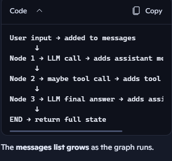

# Using messages as state in LangGraph.
Using messages as state means your graph stores the entire conversation history inside its memory, so each node and each LLM call knows what happened before.

It’s how LangGraph builds real chatbots and agents.


State: 
- state is the memory that flows through your graph.
- Every node receives the current state and returns an update.
State is just a Python dictionary that LangGraph keeps updating as your graph runs.

## 🌟 What does it mean to “use messages as state”?
It means you store chat messages (system/user/assistant messages) inside the graph’s state so that:

- the graph remembers the conversation
- each node can see the full chat history
- the LLM can respond with context
- you can build multi‑turn chatbots

So instead of storing just text, you store a list of message objects.

# 🧠 Why do we store messages in state?
Because chat models (Gemini, OpenAI, Groq, etc.) expect a list of messages like:

python
```
[
  {"role": "system", "content": "You are helpful."},
  {"role": "user", "content": "Hi"},
  {"role": "assistant", "content": "Hello!"}
]
```
If you want your LangGraph chatbot to remember the conversation, you must keep these messages somewhere like a "state" in langgraph

## 📦 What the state looks like when using messages
Here’s a typical LangGraph state schema: python
```
class State(TypedDict):
    messages: list
```
Then your graph state might look like:  python
```
{
  "messages": [
    HumanMessage(content="Hi"),
    AIMessage(content="Hello! How can I help?")
  ]
}
```
Each node receives this list and can append new messages.

## 🔄 How messages flow through the graph
Here’s the mental model:


## 🧪 Example: A simple chat node
python
```
def chat_node(state):
    response = llm.invoke(state["messages"])
    return {"messages": state["messages"] + [response]}
```
This node:
- Reads the conversation history
- Sends it to the LLM
- Appends the LLM’s reply to the state
This is the core of a chatbot graph.

## 🌟 Why this is powerful
Using messages as state lets you build:

- multi‑turn chatbots
- agents that remember previous steps
- tool‑calling agents
- ReAct‑style reasoning
- assistants that maintain context

All because the state carries the conversation forward.