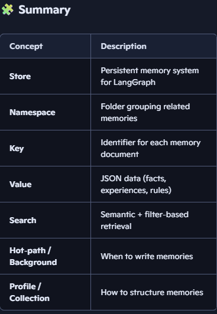

# LangGraph Store: Long-term Memory for Agents

### 1️⃣ What is the LangGraph Store?
The LangGraph Store is a built‑in system for long‑term memory in agentic AI.
It lets your agent save, recall, and search information across sessions — just like human long‑term memory.

**Think of it as a database for your agent’s memories:**
- Facts about users (semantic memory)
- Past experiences (episodic memory)
- Rules or learned behaviors (procedural memory)

### 2️⃣ Why do we need it?
Without a store, your agent forgets everything once a session ends.
With a store, it can:
- Personalize responses based on past interactions
- Learn user preferences over time
- Share knowledge across threads or agents
- This makes your AI feel more alive and context‑aware.

### 3️⃣ How LangGraph organizes memory

#### Step 1 – Install and import the right pieces to Save and retrieve long-term memories: 
```
from langgraph.store.memory import InMemoryStore  # simple store for dev
```
In production you’d swap `InMemoryStore` for a `DB‑backed store (Postgres, etc.),` but the API is the same.
    
#### Step 2 – Understand the store mental model
A store is just:

    - namespace → like a folder (often a tuple: (user_id, app_context))
    - key → like a filename inside that folder.
    - value → a JSON document (Python dict) that you save.

- LangGraph uses a namespace → key → value structure.
- Namespaces help you group memories by user, organization, or context.

#### You can use methods like:
- put a memory - save information as memory
- get a memory by key - retrive information from the store
- search memories by content/filters - Look for information

#### Step 3 – Create a long‑term memory store
For learning, use InMemoryStore: python
```
from langgraph.store.memory import InMemoryStore

store = InMemoryStore()
```

## Step 4 – Decide your namespace strategy
You want **memories** per `user` and maybe per `app-context`.

```
user_id = "user-123"
app_context = "chatbot_memory"  # or "support", "coding", etc.

namespace = (user_id, app_context)
```
Everything you store for this user+context goes under this namespace.

## Example: 4️⃣ Setting up your first store:

### Step 1: Import and initialize
python
```
from langgraph.store.memory import InMemoryStore

def embed(texts: list[str]) -> list[list[float]]:
    # Replace with a real embedding function for semantic search
    return [[1.0, 2.0] * len(texts)]

store = InMemoryStore(index={"embed": embed, "dims": 2})
```
- InMemoryStore → stores data in RAM (great for testing)
- index → enables semantic search using embeddings
- For production, use a DB‑backed store (Postgres, Redis, etc.).

### Step 2: Define your namespace
python
```
user_id = "user123"
context = "chatbot"
namespace = (user_id, context)
key = "preferences"
value = {
        "likes": "short, direct answers",
        "language": "Python",
        "interests": ["LangGraph", "AI agents"]
    }
```
This ensures your agent’s memories are scoped correctly.

### Step 3: Write a memory
python
```
store.put(namespace, key,value)
```
This saves a JSON document under that namespace.

### Step 4: Read a memory
python
```
item = store.get(namespace, "preferences")
print(item)
```
Retrieves the memory by key.

### Step 5: Search memories
python
```
results = store.search(
    namespace,
    filter={"language": "Python"},
    query="user preferences"
)
```
- filter → exact match on fields
- query → semantic similarity search using embeddings
This is how your agent finds relevant memories dynamically.

-----------------------------------------------
## 5️⃣ Types of Long‑Term Memory
LangGraph supports three conceptual types (inspired by human cognition):

Type	        Purpose	                    Example
Semantic	       Facts & knowledge	    “User likes short answers.”
Episodic	       Experiences	            “User asked about LangGraph yesterday.”
Procedural	       Rules & skills	        “Use Markdown for explanations.”

Each type can live in its own namespace: python
```
semantic_ns = (user_id, "semantic")
episodic_ns = (user_id, "episodic")
procedural_ns = ("agent_instructions",)
```

## 6️⃣ Writing memories: Hot‑path vs Background

    Mode	            Description	            Pros	                Cons
Hot‑path	        Write memory during 
                    runtime	                 Immediate updates	       Adds latency
Background	        Write memory 
                    asynchronously	         No latency	               Needs scheduling


Example hot‑path node: python
```
def update_memory_node(state):
    user_id = state["user_id"]
    ns = (user_id, "chatbot")
    existing = store.get(ns, "preferences") or {}
    existing["last_topic"] = state["messages"][-1]["content"]
    store.put(ns, "preferences", existing)

```

## 7️⃣ Managing memory complexity
**LangGraph supports two main strategies:**

### Profile approach
- One large JSON document (easy to read, harder to update safely)

### Collection approach
- Many small documents (easy to add new info, harder to get full context)
- Use semantic search and filters to retrieve relevant pieces when using collections.

### 8️⃣ Integrating with your graph
You can pass the store into your graph nodes: python
```
from langgraph.graph import StateGraph, START, END

builder = StateGraph(dict)

def agent_node(state, store):
    ns = (state["user_id"], "chatbot")
    prefs = store.get(ns, "preferences")
    response = f"I remember you like {prefs['likes']}."
    return {"messages": [{"role": "assistant", "content": response}]}

builder.add_node("agent", agent_node)
builder.add_edge(START, "agent")
builder.add_edge("agent", END)
graph = builder.compile()
```
Now your agent can read and write memories dynamically.

## 9️⃣ Best practices
✅ Use namespaces to separate users or contexts
✅ Keep memory documents small and focused  
✅ Periodically clean duplicates or outdated info  
✅ Use semantic search for flexible retrieval
✅ Store timestamps for version control
✅ Combine with LangSmith Datasets for curated episodic examples

## 🔟 Example: Memory Review Node
Here’s how you can design a node that reviews and updates memory: python
```
from langgraph.store.base import BaseStore
def review_memory_node(state, store: BaseStore):
    ns = (state["user_id"], "chatbot")
    existing = store.get(ns, "profile") or {}
    messages = state["messages"]

    # Analyze messages for new facts
    new_info = llm.invoke(
        "You are a memory-review assistant. "
        "Compare existing memory and current messages. "
        "List new or updated facts about the user as bullet points."
    )

    # Merge updates
    existing["updates"] = new_info
    store.put(ns, "profile", existing)
    return {"messages": [{"role": "assistant", "content": "Memory updated."}]}

```

