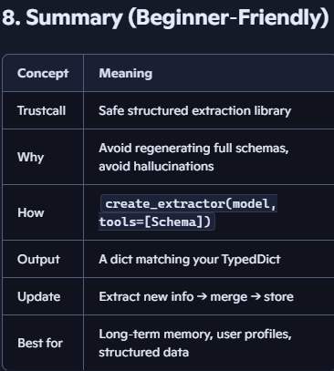

# Long Term Memory - Store -> Trust Call

1. What is Trustcall?

Trustcall is an open‑source library created by Will Fu‑Hinthorn (LangChain team) that solves a very real problem. 

Wen know that **"LLMs are bad at reliably updating structured JSON schemas"**

`Trustcall` gives you a way to tell the LLM:

    - “Here is a schema.”
    - “Extract information from text.”
    - “Fill only this schema.”
    - “Do not hallucinate fields.”
    - “Do not break types.”
It is essentially a safe structured extraction engine.

## 2. Why Trustcall Exists (The Problem It Solves)
When building memory systems we run into these issues:

### ❌ Problem 1 — Regenerating the entire profile every time
If you ask the LLM:

“Here is the old profile. Here are new messages. Produce a new profile.”

 The LLM often:

    - Drops fields
    - Rewrites everything
    - Hallucinates new fields
    - Breaks types
    - Loses information
This is expensive and unsafe.

### ❌ Problem 2 — Updating schemas is hard
If your schema grows (more fields, nested structures), the LLM struggles to:

    - Keep the structure
    - Update only the changed fields
    - Preserve old values
Avoid overwriting with empty values

### ❌ Problem 3 — Merging memory manually is painful
You end up writing custom merge logic for every field.

### ✔️ Trustcall solves all of this
Trustcall lets you:

    - Extract only the new information
    - Keep the schema stable
    - Avoid regenerating the whole profile
    - Avoid hallucinations
    - Avoid type errors
    - Merge safely

## 3. How Trustcall Works (Simple Mental Model)
Think of Trustcall as:

`A tool wrapper that forces the LLM to output a TypedDict/Pydantic schema exactly as defined.`

You give it:

    - A schema (like UserProfile)
    - A model (OpenAI, Anthropic, Gemini)
    - A text input (messages)

It returns:

    - A Python dict that matches your schema
    - No extra fields
    - No missing required fields
    - No type errors

## 4. Step‑by‑Step: Using Trustcall for Profile Extraction

#### Example: 

### Step 1 — Define your schema (TypedDict)
python
```
from typing import TypedDict, List, Dict, Optional

class UserProfile(TypedDict, total=False):
    user_name: Optional[str]
    age: Optional[int]
    interests: List[str]
    favorites: List[str]
    additional_info: Dict[str, str]   # catch‑all for new facts
```
##### Why additional_info?
- TypedDict cannot dynamically add new fields — this is your safe expansion bucket.

### Step 2 — Install Trustcall
bash
```
pip install trustcall

```

### Step 3 — Import and create the extractor
python
```
from trustcall import create_extractor

trustcall_extractor = create_extractor(
    model,                     # your LLM
    tools=[UserProfile],       # your schema
    tool_choice="UserProfile"  # force this schema
)
```
**This is the Trustcall version of:**
```
llm.with_structured_output(UserProfile)
```
**But more robust.**

### Step 4 — Prepare the text from messages
python
```
from langchain_core.messages import HumanMessage

messages = [
    HumanMessage(content="My name is D, I love writing novels."),
    HumanMessage(content="I enjoy camping and trying new foods.")
]

text = " ".join(m.content for m in messages)
```
**You can optionally include Edge tab titles as context (not instructions):**

python
```
tab_titles = " ".join(tab["pageTitle"] for tab in edge_all_open_tabs)
full_text = text + " " + tab_titles
```

### Step 5 — Extract the profile
python
```
profile: UserProfile = trustcall_extractor.extract(full_text)
print(profile)
```
Example output:
```
{
  "user_name": "Diya",
  "interests": ["writing novels", "camping", "trying new foods"],
  "additional_info": {}
}
```
This is guaranteed to match your schema.

### 5. Updating an Existing Profile (The Real Power)
Let’s say your store already has:
```
existing = {
    "user_name": "Diya",
    "interests": ["writing novels"],
    "favorites": ["coffee"]
}
```
New message: Code
```
"I recently started camping and I love spicy food."
```
Extract new info: 
```
new = trustcall_extractor.extract(full_text)
```
**Now merge: python**
```
def merge_profiles(old: UserProfile, new: UserProfile) -> UserProfile:
    merged = old.copy()

    for k, v in new.items():
        if k == "interests":
            merged.setdefault("interests", [])
            for item in v:
                if item not in merged["interests"]:
                    merged["interests"].append(item)

        elif k == "favorites":
            merged.setdefault("favorites", [])
            for item in v:
                if item not in merged["favorites"]:
                    merged["favorites"].append(item)

        elif k == "additional_info":
            merged.setdefault("additional_info", {})
            merged["additional_info"].update(v)

        else:
            merged[k] = v  # overwrite scalar fields

    return merged
```
Then write back:
```
updated = merge_profiles(existing, new)
store.put(namespace, "profile", updated)

```
## 6. Pros and Cons of Trustcall
### ⭐ Pros
✔️ 1. Safe structured extraction
LLM cannot break your schema.

✔️ 2. Perfect for long‑term memory
Extract only new info → merge → store.

✔️ 3. No hallucinated fields
TypedDict/Pydantic schema is enforced.

✔️ 4. No missing fields
Required fields are guaranteed.

✔️ 5. Works with any LLM
OpenAI, Anthropic, Gemini, etc.

✔️ 6. Reduces token usage
You don’t regenerate the whole profile every time.

### ⚠️ Cons
❌ 1. Cannot dynamically add new top‑level fields
TypedDict is static → use additional_info.

❌ 2. Requires manual merge logic
Trustcall extracts new info, but you merge it.

❌ 3. Complex schemas still require careful prompting
Nested structures can confuse the LLM.

❌ 4. Not ideal for huge documents
Better for small/medium structured profiles.

## 7. When Should You Use Trustcall?
Use Trustcall when:

- You have a profile or memory object
- You want to extract new info from messages
- You want to update memory safely
- You want to avoid regenerating the entire schema
- You want type‑safe structured output




-------------------------------------------------------------------
# Trustcall Updates to the memory

1. The idea: “don’t rewrite the whole profile”
Instead of:

Sending the entire existing profile to the model

Asking it to regenerate a new full profile

TrustCall does this:

“Here is the existing profile. Here are new messages.
Give me a JSON Patch that updates only what changed.”

Then TrustCall applies that patch to your existing dict.

Result:

Less chance of losing fields

Less chance of hallucinations

Fewer tokens (only changed parts are generated)

2. Start with a Pydantic profile model
python
from pydantic import BaseModel, Field

class UserProfile(BaseModel):
    user_name: str | None = Field(None, description="preferred name of the user")
    age: int | None = Field(None, description="age of the user")
    interests: list[str] = Field(default_factory=list, description="list of user interests")
    additionalInfo: dict[str, str] = Field(default_factory=dict, description="catches all other facts")
You’ll have an instance of this model stored as the current profile, e.g.:

python
existing_profile = UserProfile(
    user_name="Diya",
    age=30,
    interests=["Gardening"],
    additionalInfo={"location": "San Antonio"}
)

3. Serialize the existing profile to a dict
TrustCall’s update API expects the existing schema as a plain dict.

Use model_dump():

python
existing_dict = existing_profile.model_dump()
Now existing_dict looks like:

python
{
    "user_name": "Diya",
    "age": 30,
    "interests": ["Gardening"],
    "additionalInfo": {"location": "San Antonio"}
}

. Create the TrustCall updater (not just extractor)
You already used create_extractor for fresh extraction.
For updates, you still use create_extractor, but you pass an existing argument when invoking.

python
from trustcall import create_extractor

profile_updater = create_extractor(
    llm,
    tools=[UserProfile],
    tool_choice="UserProfile"
)
Same setup as before—what changes is how you call it.

5. Prepare the new messages that may change the profile
Example:

python
from langchain_core.messages import HumanMessage, AIMessage, SystemMessage

conversation = [
    HumanMessage(content="Hi, I'm Diya."),
    AIMessage(content="Nice to meet you, Diya."),
    HumanMessage(content="I recently turned 31 and I now also like hiking.")
]

System instruction:

python
sys_instr = SystemMessage(content="""
You are updating an existing user profile.

- Use the existing profile as the base.
- Only change fields when the conversation clearly provides new or conflicting information.
- Do not erase existing information unless it is explicitly contradicted.
- If new interests are mentioned, append them to the list.
- If age changes, overwrite with the new age.
- Any extra facts go into additionalInfo.
""")
6. Call TrustCall with the existing profile for update
Here’s the key part: pass existing and the schema name.

python
result = profile_updater.invoke(
    {
        "messages": [sys_instr] + conversation,
        "existing": {
            "UserProfile": existing_dict  # schema name → existing dict
        }
    }
)
Under the hood, TrustCall:

Shows the model the existing profile.

Asks it to produce a JSON Patch (only changes).

Applies that patch to existing_dict.

Returns the updated profile dict.

Your result will be a UserProfile‑shaped dict, e.g.:

python
{
    "user_name": "Diya",
    "age": 31,
    "interests": ["Gardening", "Hiking"],
    "additionalInfo": {"location": "San Antonio"}
}
Only the changed fields are updated.

7. Turn the updated dict back into a Pydantic model (optional)
If you want to keep using Pydantic instances:

python
updated_profile = UserProfile(**result)
Then you can store updated_profile in your memory store.

8. Mental model: what TrustCall is doing for updates
Before:  
You’d send the whole profile + messages → model rewrites everything → risk of losing fields.

With TrustCall:

You send existing dict + messages.

Model outputs a patch (only diffs).

TrustCall applies the patch.

You get a clean, updated profile.

You don’t see the JSON Patch directly; TrustCall handles it internally. You just see:

Input: existing dict

Output: updated dict

