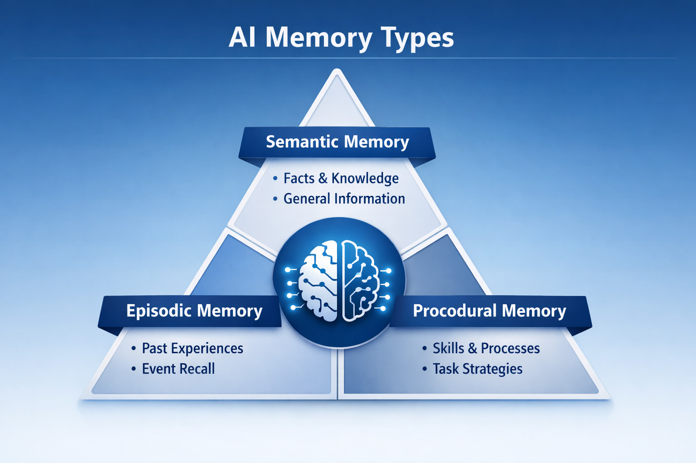
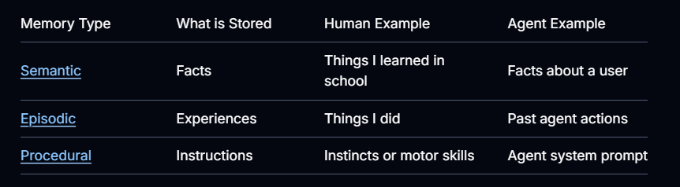

# Memory Overview

### Definition: Memory is an essential cognitive function that permits individuals to acquire, retain, and recover data that defines a person’s identity (Zlotnik and Vansintjan, 2019)

Memory is a system that rememembers information about previous interactions.

In AI, memory is crucial because it helps them adapt to user preferences by using memory as a feedback to learn. When Agents tackle more complex tasks with ultiple users, this feature becomes essential for both efficiency and user satisfaction..




## In Agentic AI we have 2 Types of Memory:

#### `1. Short Term Memory : Thread count Memory`
- State is saved in database as a checkpointer.
- Memory of each event is a checkpointer which is saved with every action
- Collection of these checkpointers are thread . which can be called ay time.
- memory persists as long as the session persists. 

#### `2. Long Term Memory: `
 - memory persists across multiple sessions and are shared across conversational threads.
 -  collection of threads sharing the experience across the session
 - experiences can be users specific or application level data 
 -  Memory can be called at any time and in any thread.
 - Memories are scoped to any custom namespace, not just within a single thread ID. 
 - LangGraph provides stores (reference doc) to let you save and recall long-term memories.

## Managing short-term memory:
- Most common form of short term memory is conversation hystory
-  Even though LLM's these days handle longer context, they can get distracted by off topic content (context poisoning) or perform poorly wbhich can result in slower response and higher cost.
- Use reducers to manage longer conversations in the chat models

## Managing Long-term memory:
- Long term memory is maintaing infromation across multiple conversations and sessions. 
-  Long term storage use 'Namespaces' and not thread
- memory is saved within the custom namespaces.

## Complexity involved in storing Long-term memory:
Different application need different type of memory.  Comparing AI memory to Human memory and breaks down the complexity a bit.

**According to CoALA paper, we can map these human memory types to those used in AI agents.**

### Example: 


`Use following questions as your framework to build a long-term memory`

`Question 1: `: **What is the type of memory?**
- Humans use memories to remember facts (semantic memory), experiences (episodic memory), and rules (procedural memory). 

- AI agents can use memory in the same ways. For example, AI agents can use memory to remember specific facts about a user to accomplish a task.

`Question 2:` **When do you want to update memories?**
- Memory can be updated as part of an agent’s application logic 
**(e.g., “on the hot path”).**
- In this case, the agent typically decides to remember facts before responding to a user. 
- Alternatively, memory can be updated as a background task (logic that runs in the background / asynchronously and generates memories). 


## 1. Semantic memory: 
Semantic memory refers to general world knowledge that humans have accumulated throughout their lives.
- This general knowledge (vocabulary, word meanings, concepts, facts, and ideas) is intertwined in experience and dependent on culture.
- New concepts are learned by applying knowledge gained from things in the past.
- semantic memory is the sum of all knowledge one has obtained—vocabulary, understanding of math, or all the facts one knows[Book: Episodic and Semantic Memory]. 

### General Definition: 
**Semantic memory, both in humans and AI agents, involves the retention of specific facts and concepts.** 
- In humans, it can include information learned in school and the understanding of concepts and their relationships.
- In AI, personalize applications by remembering facts or concepts from past interactions.

#### Note: Semantic memory is different from `“semantic search,”` which is a technique for finding similar content using “meaning” (usually as embeddings).

### Semantic memories can be managed in different ways:

## 1. Profile management:
`Profile :` **A profile is generally just a JSON document with various key-value pairs you’ve selected to represent your domain.**

- Memories can be a single, continuously updated “profile” of a user, organization, or other entity (including the agent itself).

`Profile update:` WE may need to add a JSON patch to an existing profile every time ie, you will want to pass in the previous profile and ask the model to generate a new profile . 

### Drawback : As the profile gets laonger,  it can become error prone 

### Solution : 
1. splitting a profile into multiple documents or 
2. strict decoding when generating documents to ensure the memory schemas remains valid.

`## 2. Collection :`**Alternatively, memories can be a collection of documents that are continuously updated and extended over time.**

### 1. What “collection of documents” means
Instead of one big profile JSON for a user, you store many small memory documents.

**Profile style:  One doc like**
{ name, job, preferences, history, ... }

**Collection style:  Many docs like**

{"type": "preference", "text": "likes short answers"}

{"type": "goal", "text": "wants to learn LangGraph"}

{"type": "feedback", "text": "hated long explanations"}

**Each new fact → new document, not a rewrite of a giant profile.**

### `Advantage over updating profile:`
- easier for an LLM to generate new objects for new information 
#### EX:
Updating a big profile = “Here’s the old JSON, please carefully merge this new info without breaking anything.”

Collection = “Just create one more small JSON object for this new fact.”

- LLMs are much better at creating new small objects than safely editing a big structured one.

### Result: you lose less information over time and recall is better because each memory is focused and clear.

## The Collection tradeoff:-> updating & cleaning the list
With a collection, you now have to think about:

`1. Duplicates:` “User likes short answers” stored 5 times.

`2. Conflicts:`

    Old memory: “User is a beginner.”
    New memory: “User is advanced.”

**So you need logic (or tools like Trustcall) to:**
- Decide when to insert a new memory.
- Decide when to update or delete an old one.
Some models tend to over-insert (never update, just keep adding).
Others over-update (keep editing the same item).

## Search becomes more important:
Because you now have many small docs, you must:
- Search for the relevant ones (semantic search).
- Filter by fields (e.g., {"type": "preference"}).
- In LangGraph’s store, that’s exactly what search(namespace, filter=..., query=...) is for.
 - So: collection = more power, but you must design good retrieval.

 **The Store currently supports both semantic search and filtering by content.**

 `3. Harder to give the model a “full picture”`
 With a profile, you can just:
- Fetch one doc
- Drop it into the prompt as “User profile”

With a collection, you:
- Search for relevant memories.
- Get a subset (maybe top‑k).
- Concatenate them into context.
You might miss some relationships or global patterns that a single profile could show more clearly.

### So the tradeoff is:

#### `Profile:` easy to give full context, hard to update safely.

#### `Collection:` easy to add new info, harder to reconstruct a full, coherent picture.

## Conclusion : Regardless of memory management approach, the central point is that the agent will use the semantic memories to ground its responses, which often leads to more personalized and relevant interactions.

------------------------------------------------------------------------

## 2. Episodic memory

Episodic memory = past experiences.

- Episodic memory, in both humans and AI agents, involves recalling past events or actions. 
- The CoALA paper frames this well: facts can be written to semantic memory, whereas experiences can be written to episodic memory. 
- For AI agents, episodic memory is often used to help an agent remember how to accomplish a task.

## How episodic memory is implemented?

### Few-Shot example Prompting :
In practice, episodic memories are often implemented through few-shot example prompting, where agents learn from past sequences to perform tasks correctly.

#### Example: Instead of telling the agent “format JSON like this,”
- it’s easier to “show” than “tell” and LLMs learn well from examples.
- You store a few input → output examples of correct formatting.
- These become few‑shot examples the agent retrieves when needed.

EX: 
- You store past successful interactions as small documents.
- When the agent faces a similar task, it retrieves the most relevant examples.
- These examples are inserted into the prompt as demonstrations.
This is programming the agent through examples.

### Where to store episodic memories?
“The memory store is just one way… you can also use a LangSmith Dataset.”

Meaning:
- LangGraph’s long‑term memory store (simple, built‑in), or
- LangSmith Datasets (more control, evaluation-friendly)

Ie, LangSmith is great when:
- You want curated examples
- You want evaluation + versioning
- You want to track performance over time

### Episodal Memory Mental model
Think of episodic memory as a library of past successes.

When the agent needs to perform a task:
- It searches the library
- Pulls the most relevant examples
- Uses them as few‑shot prompts
- Performs better because it “remembers how it solved similar problems before”

---------------------------------------------------------------------------

## Procedural Memory: 
Procedural memory = rules, skills, instructions.

`Humans:`
**While Episodal Memory is recalling specific experiences, such as the first time you successfully rode a bike without training wheels or a memorable bike ride through a scenic route, procedural memory is like the internalized knowledge of how to perform tasks, such as riding a bike via basic motor skills and balance.**

`AI:`
**For AI, procedural memory is a combination of model weights, agent code, and agent’s prompt that collectively determine the agent’s functionality.**

`Reflection:`  “The agent refines its own instructions based on feedback.”
- Agent learns user preferences overtime in procedural memory management. 
- It s also called meta‑prompting.

### How procedural memory is implemented
Your doc gives a pseudo‑code example:
**1. call_model node**:
- Reads the current instructions from the store
- Uses them to generate a response

**2. update_instructions node**:
- Reads the current instructions
- Reads recent conversation
- Asks the LLM to rewrite the instructions
- Saves the new instructions back to the store

This creates a loop:
`instructions → behavior → feedback → updated instructions`

EX:
```
# Node that *uses* the instructions
def call_model(state: State, store: BaseStore):
    namespace = ("agent_instructions", )
    instructions = store.get(namespace, key="agent_a")[0]
    # Application logic
    prompt = prompt_template.format(instructions=instructions.value["instructions"])
    ...

# Node that updates instructions
def update_instructions(state: State, store: BaseStore):
    namespace = ("instructions",)
    instructions = store.search(namespace)[0]
    # Memory logic
    prompt = prompt_template.format(instructions=instructions.value["instructions"], conversation=state["messages"])
    output = llm.invoke(prompt)
    new_instructions = output['new_instructions']
    store.put(("agent_instructions",), "agent_a", {"instructions": new_instructions})
    ...
```

-----------------------------------------------------------------------------

## Writing Memory in Agents:
There are 2 ways of writing memory to the store
`1. Hot-path`: Creating memories during runtime

**Idea:Real time memory update** 
- The agent writes memories while it’s answering the user.
- New memories are immediatly available for use in subsequent interactions.

#### Pros: 

**`Immediate:` new memories are available for the very next turn.**

**`Transparent:` you can tell the user “I just saved this as a memory.”**

#### Cons:
- Slower responses (extra reasoning: “should I save this?”).
- More complex agent logic (maybe a special save_memories tool).
- Agent is multitasking: answer + decide what to store.

#### Note: in LangGraph terms, hot path = a node in your main graph that calls store.put(...) during the normal flow.

`2. In the background`: Separate process / service
Idea: The agent writes memories later, outside the main user request.

#### Pros:
- No extra latency for the user.
- Cleaner main graph: it just handles the conversation.
- You can batch or schedule memory creation (e.g., every 10 minutes).

#### Cons:
- Need to decide how often to run it.
- Other threads might not see new memories immediately.
- Need triggers: cron, time‑based, or manual.

#### NOTE: So in LangGraph terms, background = another graph/service that periodically reads logs/state and writes to store.put(...).

-------------------------------------------------------------------
## Memory Storage:
- LangGraph stores long-term memories as JSON documents in a store.
- Each memory is organized under a custom namespace (similar to a folder) and a distinct key (like a file name).
- Namespaces often include user or org IDs or other labels that makes it easier to organize information. 
- This enables hierarchical organization of memories. Cross-namespace searching is then supported through content filters.

Citation: This document was writen with the help of Langchain academy langGraph course - langchain-ai/memory-template
