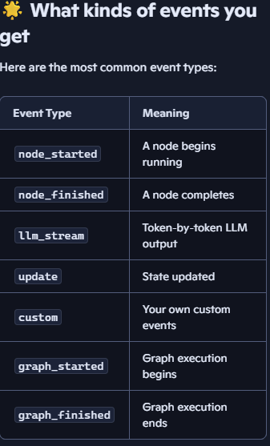

# Chat-model token streaming

#### **Streaming tokens** just means: showing the model’s response piece‑by‑piece as it’s generated, instead of waiting for the full answer. Here’s a step‑by‑step way to understand it and use it in LangGraph.

## 1. Understand what token streaming is:

##### Tokens: A token is a small chunk of text (part of a word, a word, or punctuation)

- Instead of waiting for the whole answer, you receive tokens or small chunks as they are generated.
- This makes your app feel faster and more interactive, like live typing

## Set up a simple LLM and graph
    
    - Create a minimal LangGraph so you have something to stream from.
    - Python file or notebook cell
    - Import your LLM, e.g. from langchain_openai import ChatOpenAI
    - Define a state with messages and a node that calls the LLM
    - Build and compile the graph with StateGraph → builder.compile()

## Use .astream_events method
“token streaming can be achieved using the .astream_events method, which streams back events as they happen inside nodes!”

## What .astream_events ?
 - .astream_events() is an async streaming method in LangGraph that lets you see every internal event happening inside your graph as it happens.

- Think of it like turning on “developer mode” for your graph.

###### graph.stream only aloows to see:

    - the final output
    - or just the messages

###### .astream_events lets you see everything:

    when a node starts
    when a node finishes
    what each node returns
    state updates
    custom events
    LLM token events (if enabled)
It’s the most detailed streaming mode LangGraph offers.

### Why use it? 
provides deeper visibility, like:

    debugging a graph
    watching node execution order
    seeing tool calls
    understanding how state changes
building a UI that shows node‑by‑node progress
.astream_events() is built for that.

## How to use .astream_events():
This is an async method, so you must use async for.

python
```
async for event in graph.astream_events(
    {"messages": [HumanMessage(content="Hello!")]},
    version="v2"
):
    print(event)

```
#### Note: Read more about version="v2" in Streaming_agentState.md

### Output: You’ll get events like:
```
{'type': 'node_started', 'data': {'node': 'chatbot'}}
{'type': 'llm_stream', 'data': {'token': 'Hello'}}
{'type': 'node_finished', 'data': {'node': 'chatbot'}}
{'type': 'graph_finished', 'data': {...}}
```
Each event tells you:

    what happened
    which node
    what data was produced
This is extremely useful for understanding your graph’s behavior.



## 🌟 When should you use .astream_events()?
Use it when you want:

✔️ Node‑by‑node debugging
See exactly which node runs and in what order.

✔️ Token‑level streaming
See every token the LLM generates.

✔️ Building a UI
Show progress bars, node execution, or logs.

✔️ Understanding complex graphs
Especially graphs with routers, branches, retries, or memory.

## 🌟 Summary
.astream_events() streams every internal event inside your graph.

    - It is async, so you use async for.
    - It shows node start/finish, state updates, LLM tokens, and more.
    - It’s perfect for debugging and building advanced UIs.
    - It’s more detailed than normal streaming.

# asyncio.run(run()) loop:

## ⭐ Why asyncio.run(run()) Is Necessary
1. .astream_events() is ASYNC
When you call: python
```
async for event in graph2.astream_events(...):
```
- You are using async/await features of Python.
- Async code cannot run inside normal Python code unless you start an event loop.

## ⭐ 2. Python needs an “event loop” to run async code
- Async functions don’t run by themselves.
- They need something to drive them — that’s the event loop.
- asyncio.run() is the simplest way to start that loop.

So this: python
```
async def run():
    async for event in graph2.astream_events(...):
        print(event)

asyncio.run(run())
```
#### means:

    - define an async function (run)
    - start an event loo
    - execute the async function inside it
Without asyncio.run(), Python has no loop, so async code cannot execute.

## ⭐ 3. Why you need it specifically for .astream_events()
#### .astream_events() is fully asynchronous because:

    - it streams events as they happen
    - it may wait for tokens
    - it may wait for node execution
    - it may wait for async memory (like AsyncSqliteSaver)
All of that requires an async loop.

## ⭐ 6. When to use asyncio.run()
#### we need it when:

    - using .astream_events()
    - using .astream()
    - using async memory (AsyncSqliteSaver)
    - using async LLM calls
We do not need it for:

    - .invoke()
    - .stream()
    - synchronous memory (SqliteSaver)

    ---------------------------------------------------------------------------

# How to identify and extract LLM token‑stream events when using:
**graph.astream_events(..., version="v2")**

Inside LangGraph, every event has:

    - a *type* (what kind of event it is)
    - a *metadata* section (which node produced it)
    - a *data* section (the actual content of the event)

### 1. Type: "Tokens from chat models have the **on_chat_model_stream** type.”
##### This means:

    - The event is a token from a chat model (like GPT‑4o, GPT‑3.5, etc.)
    - It is not a node start/finish event
    - It is not a state update
    - It is not a custom event

So if you want to stream only tokens, you filter for:
python
```
if event["event"] == "on_chat_model_stream":
    ...
```
### 2. Metadata: Every event includes *metadata* telling you which node produced it.
Example:

python
event["metadata"]["langgraph_node"]  # "chatbot"
##### This is useful when:

    - graph has multiple nodes
    - some nodes call LLMs
    - some nodes do not
    - you only want tokens from a specific node

So you can filter like: 
python
```
if event["metadata"].get("langgraph_node") == "chatbot":
    ...
```
*chatbot* is the Node name.

### 3. Data: Every event has a data field that contains the payload.
- use event['data'] to get the actual data for each event.”

##### For token events: event["data"] is an AIMessageChunk.

This chunk contains:

    - the token text
    - the role (assistant)
    - optional metadata

Example: python
```
event["data"].content
```
might be: Code
```
"cat"
```
- These chunks arrive one by one as the model generates them.

## Example: Here is how you stream only LLM tokens from a specific node:

python
```
async for event in graph.astream_events(input, config, version="v2"):

    # 1. Only token events
    if event["event"] != "on_chat_model_stream":
        continue

    # 2. Only from the chatbot node
    if event["metadata"].get("langgraph_node") != "chatbot":
        continue

    # 3. Extract the token
    token = event["data"].content
    print(token, end="")
This prints the model’s response token by token.

## ⭐ Summary (super clear)
- on_chat_model_stream = event type for LLM tokens
- event['metadata']['langgraph_node'] = which node produced the token
- event['data'] = the actual token chunk (AIMessageChunk)

Together, these let you:

    stream tokens
    filter by node
    build real‑time UIs
    debug your graph
understand how LangGraph executes internally

## EX: This simplifies filtering based on event types and other metadata, and will aggregate the full message in the background. 
See below for an example.
```
async for event in model.astream_events("Hello"):

    if event["event"] == "on_chat_model_start":
        print(f"Input: {event['data']['input']}")

    elif event["event"] == "on_chat_model_stream":
        print(f"Token: {event['data']['chunk'].text}")

    elif event["event"] == "on_chat_model_end":
        print(f"Full message: {event['data']['output'].text}")

    else:
        pass

# output:
Input: Hello
Token: Hi
Token:  there
Token: !
Token:  How
Token:  can
Token:  I
...
Full message: Hi there! How can I help today?
```

