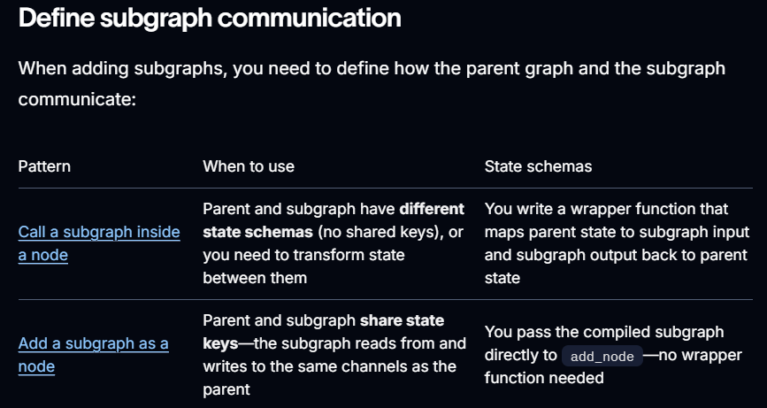

# Subgraphs
A subgraph is a graph that is used as a node in another graph.

## Subgraphs are useful for:
    - Building multi-agent systems
    - Reusing a set of nodes in multiple graphs
    - Distributing development: when you want different teams to work on different parts of the graph independently, you can define each part as a subgraph, and as long as the subgraph interface (the input and output schemas) is respected, the parent graph can be built without knowing any details of the subgraph.

### How?: Treat a subgraph as a smaller graph that you can plug into a bigger graph like a reusable function.

### Understanding sub-graph:
- A graph = nodes + edges + shared state
- A subgraph = a graph you call from another graph
The parent graph sees it as a single node that does a multi‑step job

## Decide when to use a subgraph:
- Use subgraphs when a part of your logic is complex, reusable, or logically separate from the main flow.

### Example: a dedicated research subgraph, a planning subgraph, or a tool‑calling subgraph
- Keeps the main graph simpler and easier to read
- Lets you test and debug that piece in isolation

## Set-up
1. Define sub-graph communication: The shared state for parent and subgraph
Make sure the parent graph and subgraph agree on what data they pass in and out.

    - Create a State TypedDict (or similar) with clear keys
    - Decide which keys the parent will provide (inputs)
    - Decide which keys the subgraph will update (outputs)
    - Keep the interface small and focused



2. Create a Sub-graph:
Create the subgraph as if it were a normal graph, then compile it so it can be used as a node.

    - Add nodes and edges inside the subgraph (LLM calls, tools, logic)
    - Set entry and finish nodes for the subgraph
    - Compile it (e.g., compiled_subgraph = subgraph.compile())
    - Think of compiled_subgraph as a callable node
Add the compiled subgraph as a node in the parent graph and connect it with edges or use it inside a node as a tool.

### Call a subgraph inside a node
- When the parent graph and subgraph have different state schemas (no shared keys), invoke the subgraph inside a node function. 
- This is common when you want to keep a private message history for each agent in a multi-agent system.
- The node function transforms the parent state to the subgraph state before invoking the subgraph, and transforms the results back to the parent state before returning.

### Add a subgraph as a node
- When the parent graph and subgraph share state keys, you can pass a compiled subgraph directly to add_node without a wrapper function.
- the subgraph reads from and writes to the parent’s state channels automatically. 
- For example, in multi-agent systems, the agents often communicate over a shared messages key.
```
builder = StateGraph(ParentState)
builder.add_node("node_1", node_1)
builder.add_node("node_2", subgraph)
builder.add_edge(START, "node_1")
builder.add_edge("node_1", "node_2")
```
- In the parent graph: graph.add_node("research_agent", compiled_subgraph)
- Add edges so the parent sends state into this node
- After the subgraph finishes, the parent continues with updated state
This is how you nest graphs to build bigger systems

