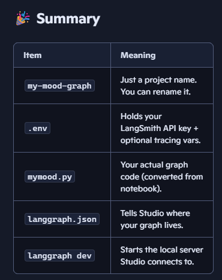

## 🎨 Setting Up LangSmith Studio (formerly LangGraph Studio)

#### LangSmith Studio : Is a specialized local development environment (IDE) designed specifically for LangGraph. 
#### It allows you to visualize, test, and debug your agents in real-time through a web-based interface that connects to your local machine.

##  🚀 Why Use LangSmith Studio?
  * Visual Inspection: See your graph's nodes and edges in action.
  * Real-time Tracing: Watch how data flows between LLMs and tools.
  * Interactive Debugging: Modify the state and re-run steps without restarting your entire script.
  * Local Execution: Your agents run on your hardware, while the UI provides a professional management layer.

## 2. Prerequisites
    - Python 3.10+ virtual environment
    - A LangSmith account (smith.langchain.com)
    - A LangSmith API key

## Set up
1. Create python3.10+ [virtual environment](./Virtual_env_dependencies.md)
2. create a project structure
    code/
        studio/
            mood_graph_2.py
            simple_mood.py
            .env              # NOT committed to git
            langgraph.json

    mood_graph_2.py — a LangGraph graph exposing a variable named graph
    simple_mood.py — a LangGraph graph/app exposing a variable named app
                   - create a executatble python file of jupyter notebook.
    .env — local environment variables (API keys, etc.)
    langgraph.json — LangGraph CLI config
                - add dependencies:
                - dependencies — tells LangGraph to load modules from the current folder
                - graphs — maps graph names to file.py:variable
                - .env — points to the .env file  

        ```
                                {
                "dependencies": ["."],
                "graphs": {
                    "mood_graph_2": "./mood_graph_2.py:graph",
                    "simple_mood": "./simple_mood.py:app"

                },
                "env": ".env"
                                }
                        ```

3. Install dependencies (inside your virtual environment):
```
bash
pip install -U "langgraph-cli[inmem]" langgraph langchain
```
#### Verify the CLI installed correctly
Run:bash
```
pip show langgraph-cli
```
If it prints details, it’s installed.
If it prints nothing, it’s not installed in this environment

#### Check if the CLI is on your PATH
Run:bash
```
which langgraph
```
If it prints nothing, your PATH doesn’t include the script folder

4. Add Environment variables in .env file
    - Create a .env file inside code/studio:
    - Add dependencies:
```
        LANGSMITH_API_KEY=lsv2_your_real_key_here
        GOOGLE_API_KEY=hfd_google_api_key

        # Optional but recommended for LangChain tracing
        LANGCHAIN_TRACING_V2=true
        LANGCHAIN_API_KEY=lsv2_your_real_key_here
        LANGCHAIN_PROJECT=mood-graphs
```
    - No quotes, no spaces, no commas.
    - if using gemini, use google api , if using openai use openai api
    - go to aistudio.google.com to create api keys 
    
 Note :Do not commit .env to Git. Add it to .gitignore (at repo root or inside code/studio):
 ## Key point:

        - mood_graph_2.py must define graph
        - simple_mood.py must define app


## 🚀 How to start LangSmith Studio locally Open your terminal?
  * Activate your virtual environment
  * Navigate into a module’s studio folder, for example: cd code/studio
  * Run:
  ```
  langgraph dev
  ```
  * This starts a local development server.
  * Think of it as a mini IDE built specifically for LangGraph workflows.
  * You run it locally, but the UI opens in your browser.
  * See traces in real time, Interact with your graph through a UI
  * Think of it as a mini IDE built specifically for LangGraph workflows.

### 🌐 What the output means When you run langgraph dev, you’ll see something like:
Code 🚀 API: http://127.0.0.1:2024 🎨 Studio UI: https://smith.langchain.com/studio/?baseUrl=http://127.0.0.1:2024 📚 API Docs: http://127.0.0.1:2024/docs Here’s what each line means:
### 🚀 API: http://127.0.0.1:2024 This is the local server running your graph.
Your graph’s endpoints live here.
### 🎨 Studio UI: https://smith.langchain.com/studio/?baseUrl=http://127.0.0.1:2024 This is the web interface where you interact with your graph.
Even though the UI is hosted on LangSmith’s website, it connects to your local graph through the baseUrl parameter.
This is why your API keys matter — they authenticate you to the Studio UI.
### 📚 API Docs: http://127.0.0.1:2024/docs This opens Swagger-style documentation for your graph’s API. 

## 🧠 Why this matters for the course LangGraph Academy uses Studio heavily:
  * You build a graph
  * You run it locally
  * You open Studio UI
  * You test your agent visually
  * You debug step-by-step
  * It’s one of the best ways to understand how LangGraph works. You can test endpoints directly from here.


#🧠 Workflow Summary
* Build/Modify your graph in the provided Jupyter Notebooks.
* create a python executable file in studio folder with .env file
    - Export your notebook as .py:
    bash
    ```
    jupyter nbconvert --to python Simple_3Node_MoodGraph.ipynb
```
* Launch the Studio via langgraph dev in the terminal.
* Open the Studio UI link in your browser.
* Interact with your agent visually to verify its logic and tool-calling capabilities.

## langgraph.json :
Since your files live inside code/studio, and you run langgraph dev from inside that folder, your JSON should reference the Python files relative to that folder.

```
{
  "dependencies": ["."],
  "graphs": {
    "mood_graph": "./mood_graph.py:graph"
  },
  "env": ".env"
}
### what it means?
"dependencies": ["."]  : 
Means “load Python modules from the current folder”.

"mood_graph": "./mood_graph.py:graph"  
Means:load the file mood_graph.py

find the variable named graph inside it
(this must be your compiled LangGraph object)

"env": ".env"  
Means load environment variables from the .env file in the same folder.



## .env file

### 🧩 Why you need LANGSMITH_API_KEY
This key does one thing:
✔️ It authenticates you to LangSmith Studio.
Without it, Studio cannot:

    - connect to your LangSmith account
    - show your traces
    - load your projects
    - connect to your local LangGraph server
    - So this one is mandatory.

Your .env must contain: LANGSMITH_API_KEY=lsv2_your_key_here

### Other Variables

1️⃣ LANGCHAIN_TRACING_V2=true
This tells LangChain:

    - “Send all LLM/tool/agent traces to LangSmith.”
    - If you don’t set this:
    - your agent still works
    - Studio still connects
    - but you won’t see traces from your agent runs
    - So it’s optional, but extremely useful.

2️⃣ LANGCHAIN_API_KEY=lsv2_...
This is the same key as your LangSmith key.

    - It’s only needed if you want:
    - LangChain’s built‑in tracing
    - LangChain’s evaluation tools
    - LangChain’s dataset features
    - If you’re only using LangGraph + Studio, you can skip it.

3️⃣ LANGCHAIN_PROJECT=my-mood-graph
This just organizes your traces into a named project.

- If you don’t set it:
- LangSmith will still work
- your traces will just go into the “default” project
- So again, optional.

# Using LLMs in graph
- ensure .env file has API key for Llm's in Studio folder
- Ensure graph can be imported in another python file
- debug:python
``` 
from chain_toolCall import graph2
print(graph2)
```
If it prints path, graph is working

