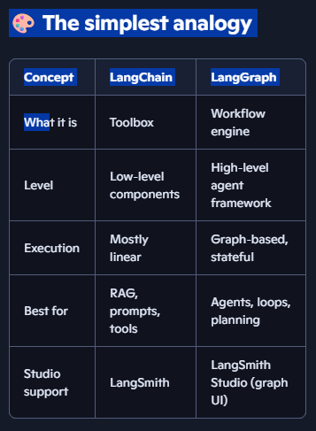

# create a markdown 
# 🧠 LangChain vs. LangGraph — the real difference
Think of them as two different layers in the same ecosystem:

## 🧩 1. LangChain = Tools + Components
LangChain is a library that gives you:

    * LLM wrappers
    * Prompt templates
    * Retrievers
    * Vector stores
    * Tool interfaces
    * Document loaders
    * Chains (simple sequences of steps)

It’s basically the toolbox for building LLM applications.

✔️ Best for:

    * Quick prototypes
    * Simple pipelines
    * Retrieval‑augmented generation (RAG)
    * Calling tools from an LLM
    * Building small workflows

❌ Not great for:

    * Multi‑step agents
    * Stateful workflows
    * Complex control flow
    * Long‑running processes
    * Agents that need memory or loops

## 🔁 2. LangGraph = State Machines for Agents
LangGraph is a framework for building stateful, multi‑step agents.

#### It gives you:
    * Nodes (steps)
    * Edges (transitions)
    * Control flow (loops, branches, retries)
    * Persistent state
    * Checkpoints
    * Human‑in‑the‑loop
    * Deterministic execution
    * Visual debugging (Studio)

LangGraph is built specifically for agentic workflows, not just single LLM calls.

✔️ Best for:

    * ReAct agents
    * Tool‑using agents
    * Multi‑step reasoning
    * Agents that need memory
    * Complex workflows
    * Production‑grade agent systems

Anything that needs reliability + traceability

❌ Not meant for:

    * Simple one‑shot LLM calls
    * Basic RAG without agent behavior

### Example:

A LangGraph node might call an LLM. That LLM is a LangChain ChatOpenAI object. The agent uses LangChain tools. The whole workflow is orchestrated by LangGraph.

So, it’s not “LangChain OR LangGraph” — it’s:

👉 LangChain = building blocks  
👉 LangGraph = architecture for agents
## 🚀 Why LangGraph exists (the short version)
LLMs are not reliable when you ask them to:

    * plan
    * reason step‑by‑step
    * call tools repeatedly
    * maintain state
    * follow strict rules
    * avoid hallucinations

LangGraph fixes this by giving you:

    * deterministic execution
    * explicit state
    * explicit control flow
    * tool‑calling loops
    * human‑in‑the‑loop
    * debugging UI

This is why the LangChain team now recommends: Use LangChain for components, LangGraph for agents.
