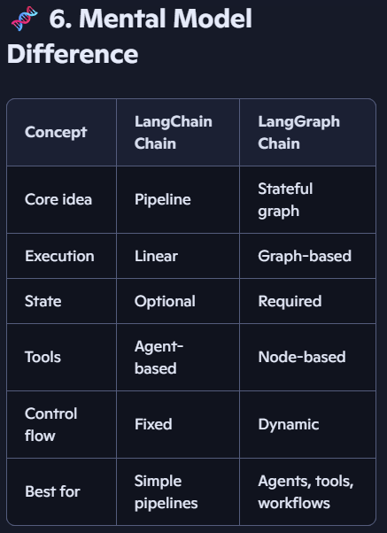

# 🔥 LangGraph Chain vs. LangChain Chain

The short version
LangChain Chains = stateless pipelines  
LangGraph Chains = stateful graphs

LangChain is great for simple LLM pipelines.
LangGraph is built for agents, tools, state, and complex orchestration.

🧩 1. Execution Model

### LangChain Chain

    - A chain is a fixed sequence of steps.
    - Execution is strictly linear.
    - No loops, no branching, no conditional routing.

You pass input → it runs through the pipeline → you get output.

#### Mental model:   A conveyor belt.

### LangGraph Chain
A “chain” is just a graph with one path, but the underlying system supports:

    - branching
    - loops
    - conditional edges
    - tool routing
    - multi-agent workflows
    - Even the simplest chain is built on a graph engine.

#### Mental model:  
A train track system — even if you only use one track today, the switches exist.

## 🧠 2. State Handling
#### LangChain Chain :Mostly stateless.

    - Each step receives input and returns output.
    - Memory is optional and bolted on.

#### LangGraph Chain : State is first-class.

    - Every node receives and returns a shared state object.
    - State is merged automatically.

#### Perfect for:
    - chat histories
    - tool outputs
    - agent state
    - long-running workflows

This is why notebook starts by defining a State TypedDict — it’s foundational.

## 🔧 3. Tool Use
#### LangChain Chain : Tools are usually invoked via an agent.
    - Tools are not part of the chain structure itself.

#### LangGraph Chain : Tools can be:

    - Bound directly to nodes
    - Invoked inside nodes
    - Routed conditionally
    - Tool calls become part of the graph execution

This is why notebook shows binding tools to the model inside the graph.

## 🏗️ 4. Control Flow
#### LangChain Chain
No built-in support for:
    - loops
    - retries
    - conditional branching
    - multi-agent orchestration

### LangGraph Chain
Native support for:
    - if/else edges
    - loops (while-style edges)
    - breakpoints
    - human-in-the-loop interactions
    - multi-agent collaboration

## 🛠️ 5. Debugging & Observability
#### LangChain Chain
    - Tracing exists (via LangSmith), but the structure is linear.

#### LangGraph Chain
Graph execution is visualized as:

    - nodes — individual steps or components in the graph
    - edges — conditional, branching, or looping transitions between nodes
    - state transitions — shared-state updates passed and merged across nodes
    - Perfect for debugging complex agent workflows

## 🎯 Takeaway:

    - A LangChain Chain is a pipeline.
    - A LangGraph Chain is a workflow graph that happens to be linear.

    - LangChain is great for simple LLM pipelines.
    - LangGraph is built for agents, tools, state, and complex orchestration.

