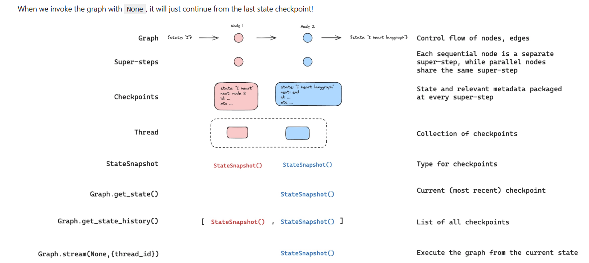

# ⭐ What “persistence” means in LangGraph

    - Persistence means your LangGraph agent can remember past state across runs, sessions, or kernel restarts, instead of starting from zero every time.

    - Means saving and re‑loading the agent’s state across runs, instead of starting from scratch every time.

## ⭐ Why persistence matters
When you run a LangGraph agent, state maintains:

    - messages
    - tool results
    - memory variables
    - intermediate values
    - anything stored in the graph’s state schema
By default, this state exists only in RAM and disappears when:

- the cell finishes runningning
- the kernel restarts
- you run a new graph invocationarts
Persistence means storing that state somewhere durable so the agent can pick up where it left off.

## ⭐ Why use persistance Memory?
1. Long‑term memory 

    - previous user messages
    - past tool results
    - conversation history
    - user preferences
    - state retained across notebook restarts

2. Multi‑turn reasoning
If you say:

    “Add 10 and 20”
    “Now multiply that by 3”

The agent needs to remember the previous result.
Persistence makes that possible.

3. human in the loop: 

    - allowing humans to inspect, interrupt, and approve graph steps and then resume execution after the person has made any updates to the state.

4. Debugging/Time-travel
    
    - allowing users to replay prior graph executions to review and / or debug specific graph steps
You can inspect the saved state to understand:

    - what the agent thought
    - what tools it called
    - what messages it stored

5. Fault-tolerance / error-recovery:
    - if one or more nodes fail at a given superstep, you can restart your graph from the last successful step.

6. Pending writes: 
    - When a graph node fails mid-execution at a given super-step, LangGraph stores pending checkpoint writes from any other nodes that completed successfully at that super-step. When you resume graph execution from that super-step you don’t re-run the successful nodes.

7. Production readiness
Real applications need:

    - Crash recovery — resume from last successful checkpoint without re-running completed steps
    - Session continuity — preserve state across restarts, runs, and sessions
    - Multi-user state separation — isolate and persist per-user state and access controls
    - Persistence is essential for enabling crash recovery, session continuity, and multi-user isolation

## ⭐ How persistence works in LangGraph
- LangGraph has a built-in persistence layer that saves graph state as checkpoints.
- This built-in persistence layer gives us memory, allowing LangGraph to pick up from the last state update.

LangGraph also supports persistence through:

- SQLiteLite
- Postgres
- File-based checkpointsgres
- Custom storage backends

## Example:
Python
```
from langgraph.checkpoint.sqlite import SqliteSaver

checkpointer = SqliteSaver("memory.db")
graph = builder.compile(checkpointer=checkpointer)
```
Now your agent’s state is saved into memory.db after every step.
Next time you run: python
```
graph.invoke(...)
```
the graph loads the previous state automatically.

-------------------------------------------------------------------------------

# 🧠 What is MemorySaver in LangGraph?
MemorySaver is a temporary, in‑memory checkpoint system that lets LangGraph agents maintain state during execution, but not across restarts.

MemorySaver is a built‑in LangGraph component that provides lightweight persistence for your agent’s state.

Think of it as:

A simple, in‑memory checkpointing system that lets your agent remember previous steps during a single session.
- Not a database or long‑term storage
- Temporary scratchpad for in‑process state
- Keeps graph state only while the process is running

## 📦 What MemorySaver does and does not do
✔ What it DOES
- Stores state between graph stepsteps
- Allows multi‑turn workflows inside a single invocation
- Enables tool → LLM → tool → LLM loopstion
- Keeps messages and variables alive during execution

✘ What it DOES NOT do
- Save state to disk
- Persist across kernel restarts
- Provide long-term memory
- Support multi-session memory

For long-term memory, you’d use a checkpointer like:
- SqliteSaver — disk-backed SQLite checkpointer for local long-term persistence
- PostgresSaver — scalable Postgres checkpointer for multi-user and production use
- FileSystemSaver — file-based checkpointing (JSON/flat files) for simple durable storage

## 🧩 How MemorySaver is used
You typically see it in LangGraph examples like: python
```
from langgraph.checkpoint.memory import MemorySaver

checkpointer = MemorySaver()
graph = builder.compile(checkpointer=checkpointer)

```
This means:
- The graph will save state between steps
- But only in RAM
- And only for the duration of the process

---------------------------------------------------------------------------

# ⭐ What a Thread ID Is
A thread ID is a unique identifier that represents one conversation or session of your agent.
Think of it like:

- a chat session ID
- a conversation history bucket
- a per-user memory container for on user
Every time you run a graph with persistence enabled, LangGraph stores the state under a thread ID so it can be retrieved later.

POints : 
- A thread is a unique ID or thread identifier assigned to each checkpoint saved by a checkpointer.
-  To persist state, a thread must be created prior to executing a run. 
- The checkpointer uses thread_id as the primary key for storing and retrieving checkpoints. Without it, the checkpointer cannot save state or resume execution after an interrupt, since the checkpointer uses thread_id to load the saved state.

## ⭐ Why Thread IDs Matter
Thread IDs allow your agent to:

#### ✔ Remember past messages
If you run: python
```
graph.invoke({"messages": [...]}, thread_id="user123")
```
Then later: python
```
graph.invoke({"messages": [...]}, thread_id="user123")
```
The agent loads the same state, continuing the conversation.

#### ✔ Support multiple users
Each user gets their own thread:

    thread_id="alice"
    thread_id="bob"
    thread_id="session_001"
Each thread has its own memory.

#### ✔ Persist state across notebook restarts
If you use a real checkpointer (SQLite, Postgres), the thread ID lets you resume conversations even after shutting down the kernel.

## ⭐ Where You Use Thread IDs
### Example:
##### When invoking a graph: python
```
graph.invoke(
    {"messages": [HumanMessage(content="Hello")]},
    thread_id="my-session-1"
)
```
##### Or in streaming: python
```
for event in graph.stream(
    {"messages": [...]},
    thread_id="my-session-1"
):
    ...
```

## ⭐ How Thread IDs Work With Persistence
If you compile your graph with: python
```
graph = builder.compile(checkpointer=SqliteSaver("memory.db"))
```
Then LangGraph stores state like: Code
```
memory.db
 ├── thread_id: "session1"
 ├── thread_id: "session2"
 └── thread_id: "user123"
 ```
Each thread ID has its own saved state.

## ⭐ Thread ID with MemorySaver and SQlite/Postgress
Since your notebook uses MemorySaver, here’s the difference:

### MemorySaver
    - Stores state in RAM only
    - Thread ID is valid only within the same Python session
    - Memory is cleared when the kernel restarts

### SQLiteSaver / PostgresSaver
    - Stores state on disk
    - Thread ID persists across restarts
    - Ideal for real applications

## How everything works together?
- The checkpointer write the state at every step of the graph
- These checkpoints are saved in a thread
- We can access that thread in the future using the thread_id

-------------------------------------------------------------------------

#  saved snapshot of your agent’s state at a specific moment in time.

    - Think of it like a video-game save point.
    - After each agent step, LangGraph writes a checkpoint.
    - To continue later, the agent loads the latest checkpoint.
    - Enables pausing, resuming, and continuing conversations without losing context.

## ⭐ Why Checkpoints Matter
Checkpoints enable:

✔ Multi‑turn conversations
Your agent can remember previous messages and tool results.

✔ Long‑running workflows
If your agent needs multiple steps (LLM → tool → LLM → tool), checkpoints keep the state alive.

✔ Persistence across sessions
With a real storage backend (SQLite, Postgres), your agent can remember things even after you close the notebook.

✔ Multi‑user support
Each user gets their own checkpoint history, identified by a thread ID.

## ⭐ How Checkpoints Work
Every time the graph executes a node, LangGraph:
- Update the graph state with the node's outputs
- Save the updated state as a checkpoint
- Proceed to the next node
If you run the graph again with the same thread ID, LangGraph loads the last checkpoint and continues from there.

## ⭐ Checkpoints + Thread ID
These two concepts work together:

    Thread ID = the conversation/session identifier
    Checkpoint = the saved state for that thread

Example: python
```
graph.invoke(
    {"messages": [...]},
    config = {"configurable": {"thread_id": "1"}}
)
```
LangGraph will:

    - Look up the last checkpoint for user123
    - Load the saved state
    - Continue the conversation

# ⭐ Types of Checkpointers
LangGraph supports several checkpoint storage options:

1. MemorySaver (in‑memory only)
    - Fast
    - Temporary
    - Lost when kernel restarts
    - Great for notebooks and demos

2. SQLiteSaver (disk persistence)
    - Saves checkpoints to a .db file
    - Survives restarts
    - Perfect for small apps

3. PostgresSaver (production‑grade)
    - Stores checkpoints in a Postgres database
    - Supports many users
    - Ideal for deployed agents

------------------------------------------------

# State Checkpoints and history



1. Get State:
```
state = graph.get_state(thread)
```
where thread is : thread = {"configurable":{'thread_ID': "1"}}

Get the most recent and current checkpoints

2. Super- step : 
 Each super-step is a sequencial node collecting state information and its metadata as well as what's next .

3. checkpointer: 
stores and save state using a thread ID

4. Thread ID: collection of stored data or checkpointers

5. capture what's next:
superstep smartly notes what node comes next. we can use this to identify next execution task
```
state = graph.get_state(thread)
Next = state.next
```
- Shows what node is next wiht node name.

