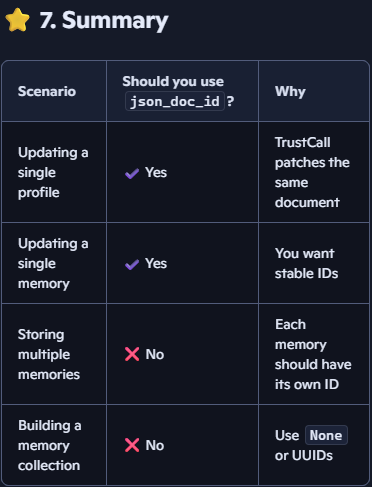

# ⭐ 2. What is json_doc_id?

**json_doc_id is a special ID that TrustCall generates only when you use updates (JSON Patch mode).**

#### It is used to:
- Identify which document is being updated
- Apply patches to the correct document
- Track changes across multiple update calls

### ✔ When you use TrustCall for updates
**TrustCall returns:**
```
"json_doc_id": "some-uuid"
```
**This ID tells you:**

`“This is the document I patched. Store it under this ID so I can update it again later.”`


## ⭐ 6. When to use json_doc_id (advanced)
**Use it only if:**
- You have a single profile object
- You want TrustCall to update that object over time
- You want stable document IDs for patching

### ❌ When you use TrustCall for inserts(new memory creation)
- TrustCall does NOT return json_doc_id.

## ⭐ 4. When should you use json_doc_id?

### ✔ Use json_doc_id when:
- You are updating an existing memory
- You want TrustCall to patch the same document later
- You want stable document IDs

### ❌ Do NOT use json_doc_id when:
- You are storing new memories
- You are building a collection of memories
- You want each memory to have its own unique ID

**In those cases, you should use:**
```
store.put(namespace, None, value)
```
- Let the store auto‑generate IDs.

## ⭐ 5. Recommended pattern for memory collections
If you are building a collection of memories, the recommended pattern is:
```
store.put(namespace, None, m.model_dump(mode='json'))
```
**This:**
- Lets LangGraph generate unique IDs
- Avoids collisions
- Avoids mixing update IDs with insert IDs
- Keeps your memory store clean


