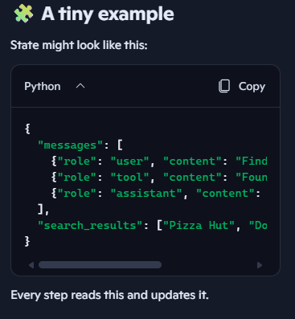

# 🌱 What “state” means ?
- Think of state as a memory box your program carries with it as it runs.
- State = a shared data dictionary that your whole agent uses.

    * It stores information (converstaions so far)
    * It gets updated over time (tool results and agetn decisions, workflow data)
    * Every step of your agent can read from it and write to it
Without state, your agent would forget everything between steps.Think of it like a backpack your agent carries.This backpack travels with the agent through every step.

## 🎒 A real‑life analogy
Imagine you’re doing a scavenger hunt.
You carry a backpack.

    * Inside the backpack, you keep:

        * clues you’ve found
        * items you’ve collected
        * notes you’ve written
        * Your backpack = state.
Every time you find something new, you put it in the backpack.
Every time you need to decide what to do next, you look inside the backpack.

That’s exactly how LangGraph uses state.

## 🌱 What a “State schema” really is
In LangGraph, state is just a Python dictionary that holds all the information your agent needs as it runs.
A State schema is simply the definition of what that dictionary should contain.
You define it using TypedDict (a Python type hinting tool).

## 🧠 Why state matters in LangGraph
LangGraph builds multi‑step agents.

    * Each step might:
    * call a tool
    * think
    * search the web
    * update memory
    * ask the user for input

To make this work, the agent needs a place to store:

    * the conversation so far
    * tool results
    * decisions it has made
    * partial answers
    * errors or retries
    * That place is the state.

# 🔁 How state works in a LangGraph agent
Here’s the loop:

    * State starts empty  
    (like an empty backpack)

    * A node runs and adds something to the state  
    (e.g., “user asked: What’s the weather?”)

    * Another node reads the state and decides what to do  
    (e.g., “I need to call the weather API”)

    * The result gets added to the state  
    (e.g., “weather result: sunny”)

The agent continues until it has enough info to answer



## 🎨 Why LangGraph emphasizes state
LangGraph is built around state machines.

#### That means:

    * every node receives the state
    * every node returns an updated state
    * the graph decides what to do next based on the state

#### This makes agents:

    * predictable
    * debuggable
    * reliable
    * easy to visualize in Studio

You can literally see the state change step‑by‑step in LangSmith Studio.

# 🧩 What is a “State schema”?
A schema is just a description of what can go inside the backpack.
For example, you might define:

##### python code:
``` class State(TypedDict):
    messages: list
    search_results: list   
```

This tells LangGraph:
    - “State must have a messages list”
    - “State may have a search_results list”
It’s like giving rules for what the backpack can contain.

## 🔁 Now: What are Nodes and Edges?
In LangGraph:
Nodes = steps in your agent (LLM call, tool call, logic step)
Edges = connections between steps (what happens next)
Every node receives the state as input and returns an updated state as output.

## 🎯 So what does the sentence mean?
“The State schema serves as the input schema for all Nodes and Edges in the graph.”

It means: 👉 Every node and every edge in your graph receives the same State object as input.
    - They all read from the same backpack.
    - They all update the same backpack.
    - They all follow the same rules (the schema) about what can be inside the backpack.

## 🧠 Why this matters?
Because:
    - your agent might have many steps
    - each step needs to know what happened before
    - each step must update the shared memory
    - LangGraph needs a consistent structure to manage this

The State schema ensures everything stays organized.

## 🎒 A simple analogy
Imagine a group project:
- The State is the shared notebook everyone uses.
- The State schema is the rule:
“The notebook must have a To‑Do list and a Notes section.”
- Each Node is a team member doing a task.
- Each Edge is the handoff from one member to the next.
- Everyone reads the same notebook.
- Everyone writes in the same notebook.
- The notebook always follows the same structure.