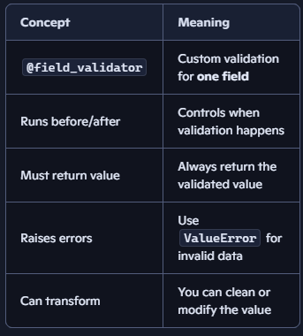
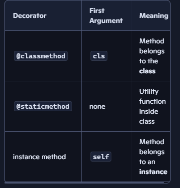

# 1. What is Pydantic?
Pydantic is a Python library that lets you define data models using type hints and then automatically validates and converts incoming data to match those types. 

*In plain words:* You describe what your data should look like, and Pydantic checks that reality matches it.

## 2. Install Pydantic
In a terminal: bash
```
pip install pydantic
```
That’s all you need to start. 

3. Your first Pydantic model : python
```
from pydantic import BaseModel

class Person(BaseModel):
    name: str
    age: int
```
BaseModel is the base class for all Pydantic models.  
Each attribute has a type: name: str, age: int.

### Create an instance: python
```
p = Person(name="Lance", age=30)
print(p)
# Person(name='Lance', age=30)
```

### 4. Automatic validation
Now pass wrong types: python
```
p = Person(name="Lance", age="30")
```
Pydantic will try to coerce "30" to an int → this actually works. 

But: python
```
p = Person(name="Lance", age="thirty")
```
This raises a ValidationError:

# Set Validation Error: python
```
from pydantic import ValidationError

try:
    p = Person(name="Lance", age="thirty")
except ValidationError as e:
    print(e)
```
You’ll see a clear error telling you age must be an integer.

## 6. Default values and optional fields
python
```
from typing import Optional
from pydantic import BaseModel

class User(BaseModel):
    name: str
    age: int = 18          # default
    email: Optional[str] = None  # can be None

u = User(name="Diya")
print(u)
# name='Diya' age=18 email=None
```
Pydantic fills in defaults and enforces types. 

## 7. Nested models
You can compose models: python
```
class Address(BaseModel):
    city: str
    country: str

class UserWithAddress(BaseModel):
    name: str
    address: Address # above class

u = UserWithAddress(
    name="Lance",
    address={"city": "San Antonio", "country": "USA"}
)
print(u)
```
- address is automatically parsed into an Address object
- Pydantic will validate nested structures for you. 

-------------------------------------------------------------
# 8. How this connects to your LangGraph/state work
You’ve seen:

    TypedDict → accessed like state["name"]

    dataclass → accessed like state.name

With Pydantic: python
```
from pydantic import BaseModel
from typing import Literal

class State(BaseModel):
    name: str
    mood: Literal["happy", "sad"]
```
Inside a node: python
```
def node_1(state: State):
    print(state.name)
    print(state.mood)
    return {"mood": "happy"}

```
Pydantic gives you:

    - runtime validation (unlike plain dataclasses)
    - clean, object-style access (unlike dicts)
    - great error messages when state is wrong
-------------------------------------------------------------------------

## ✅ 1. What is a field_validator?
A Pydantic field_validator is a way to add custom validation logic to a single field in a Pydantic model.

A field_validator is a function inside your Pydantic model that:

    - receives the value of a field
    - checks or transforms it
    - returns the validated value
    - raises an error if the value is invalid
It is used when you want more control than simple type checking.

## ✅ 2. Basic Syntax (Pydantic v2)
python
```
from pydantic import BaseModel, field_validator

class User(BaseModel):
    age: int

    @field_validator("age")
    def check_age(cls, value):
        if value < 0:
            raise ValueError("Age cannot be negative")
        return value
```
What happens?
When you create a User, Pydantic calls check_age()
    - If the value is invalid → raises a validation error
    - If valid → returns the value

## ✅ 4. Example: Transforming the value
You can also modify the value: python
```
class User(BaseModel):
    username: str

    @field_validator("username")
    def clean_username(cls, value):
        return value.strip().lower()

# Input: python

User(username="   ALICE   ")
# Output:

username='alice'
```
## ✅ 5. BEFORE vs AFTER validators
Pydantic has two modes:

#### 1.after (default)
        Runs after Pydantic converts the type.

##### Example python
```
@field_validator("age")
def validate(cls, value): ...
```

#### before
       Runs before Pydantic converts the type.

##### Example python
```
@field_validator("age", mode="before")
def validate(cls, value): ...
```
Use before when:

    - you want to clean raw input
    - you want to convert strings to numbers
    - you want to handle messy data

### NOte:  you can use field_validator for multiple fileds in the class



-----------------------------------------------------------------
# 🌟 What is cls?
cls means the class itself.

It’s the same idea as self, but:

    self = the instance
    cls = the class

In a Pydantic validator, you’re not validating one instance method — you’re validating a class-level rule.
So Pydantic passes the class into the validator, not the instance.

That’s why the first argument is always cls.

## 🎯 Quick analogy
Think of it like a factory:

    cls = the blueprint
    self = the finished product
Validators run while the product is being built, so only the blueprint exists.

## 🌟 What is @classmethod?
*@classmethod* is a Python decorator that turns a method into a class method.

That means: The first argument becomes cls (the class itself)

#### So: python
```
@classmethod
def my_method(cls):
    ...
```
cls refers to the class, not an object.

## ⭐ When should you use @classmethod?
✔ When writing Pydantic validators
Because validators run before the instance exists.

✔ When you need to access class-level constants
python
```
class User(BaseModel):
    MIN_AGE = 18
    age: int

    @field_validator("age")
    @classmethod
    def check_age(cls, value):
        if value < cls.MIN_AGE:
            raise ValueError("Too young")
        return value
```
✔ When you want a method that belongs to the class, not the instance


--------------------------------------------------------------------

# ⭐ What is model_validator?
model_validator is a Pydantic decorator used to validate the entire model at once, not just a single field.

Think of it this way:

    field_validator → checks one field
    model_validator → checks multiple fields together or the whole object

It’s perfect when:

    - two fields depend on each other
    - you need to enforce cross‑field rules
    - you want to modify the final model before returning it

## ⭐ Two Modes: before and after
1. mode="before"
Runs before Pydantic parses fields.

Use it when:

- you want to clean raw input
- you want to transform the incoming dict
- you want to enforce structure before validation

2. mode="after" (default)
Runs after all fields are validated.

Use it when:

    - you want to check relationships between fields
    - you want to enforce business rules
    - you want to modify the final model

⭐ Basic Example (after‑validation)
python
```
from pydantic import BaseModel, model_validator, ValidationError

class User(BaseModel):
    password: str
    confirm_password: str

    @model_validator(mode="after")
    def check_passwords_match(self):
        if self.password != self.confirm_password:
            raise ValueError("Passwords do not match")
        return self

```
Try it: python
```
User(password="abc123", confirm_password="abc123")   # OK
User(password="abc123", confirm_password="xyz")      # ❌ raises error
```
This is something you cannot do with field_validator.

## ⭐ Example: Validate age + mood together
python
```
class Person(BaseModel):
    age: int
    mood: str

    @model_validator(mode="after")
    def validate_logic(self):
        if self.age < 18 and self.mood == "sad":
            raise ValueError("Minors cannot be sad in this system")
        return self
```
This is just an example of cross‑field logic.

## ⭐ Example: Using mode="before" to clean input
python
```
class User(BaseModel):
    name: str
    age: int

    @model_validator(mode="before")
    def clean_input(cls, data):
        # Trim whitespace from all string fields
        if "name" in data:
            data["name"] = data["name"].strip().title()
        return data
```
Input: python
```
User(name="   diya   ", age="12")
```
Output: 
```
name='Diya' age=12
```
## ⭐ When to use model_validator instead of field_validator
Use model_validator when:

✔ You need to validate relationships between fields
Example: start_date < end_date

✔ You need to modify the whole model
Example: auto‑generate a username from name + age

✔ You need to validate after all fields are parsed
Example: ensure total calories = sum of macros

✔ You need to clean the raw input dict
Example: convert keys, normalize data


## ⭐ Full Example You Can Run
python
```
from pydantic import BaseModel, field_validator, model_validator, ValidationError

class Exercise(BaseModel):
    name: str
    reps: int
    duration: float

    @field_validator("name")
    @classmethod
    def validate_name(cls, value):
        if not value.strip():
            raise ValueError("Name cannot be empty")
        return value.title()

    @model_validator(mode="after")
    def validate_exercise(self):
        if self.reps <= 0 and self.duration <= 0:
            raise ValueError("Either reps or duration must be positive")
        return self
```
This model:

    - cleans the name
    - ensures the exercise is meaningful

